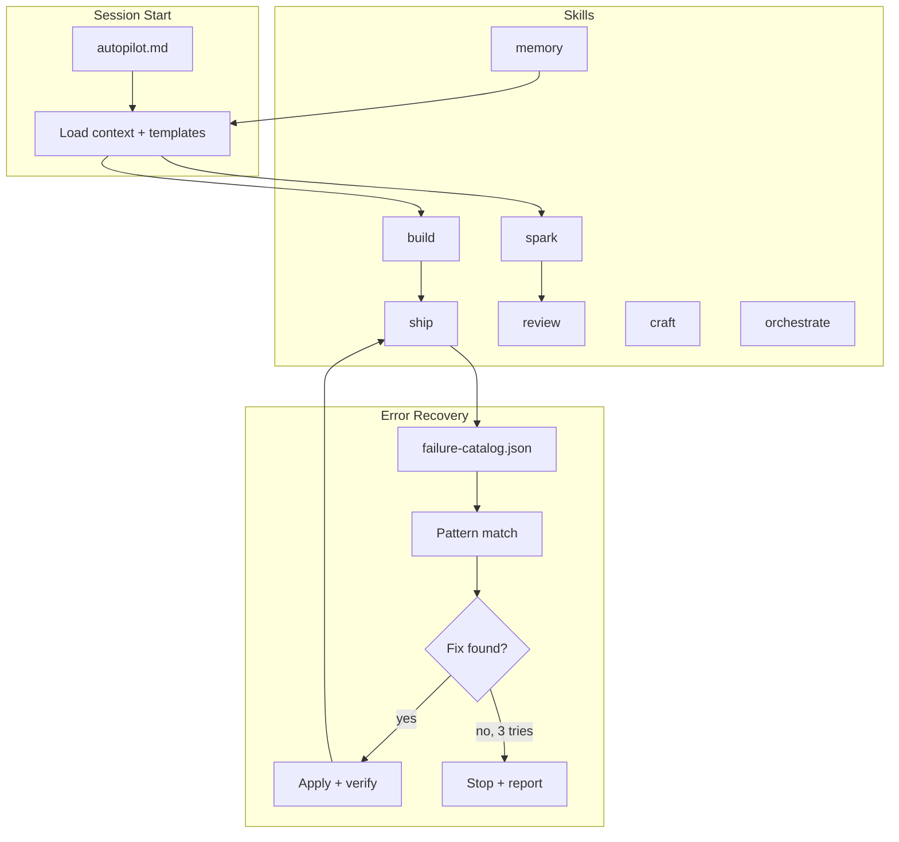

# solo-cto-agent

[](https://www.npmjs.com/package/solo-cto-agent)
[](https://github.com/{{GITHUB_OWNER}}/solo-cto-agent/actions/workflows/package-validate.yml)
[](https://github.com/{{GITHUB_OWNER}}/solo-cto-agent/actions/workflows/test.yml)
[](https://github.com/{{GITHUB_OWNER}}/solo-cto-agent/actions/workflows/changelog.yml)
[](LICENSE)


I made this because I got tired of using AI coding tools that were good at writing code, but still left me doing all the messy CTO work around it.

The hard part was rarely "write the feature." It was everything around the feature:

* catching missing env vars before a deploy breaks
* not re-explaining the same stack every new session
* stopping error loops before they waste half an hour
* getting honest pushback on ideas instead of empty encouragement
* cleaning up UI that looks obviously AI-generated

This repo is my attempt to package those habits into a small set of reusable skills. It is not magic. It is not a replacement for judgment. It is just a better operating system for the kind of AI agent I wanted to work with.

## What this is

`solo-cto-agent` is an opinionated skill pack for solo founders, indie hackers, and small teams using AI coding agents in their build workflow.

Primary workflow: Cowork + Codex.  
It was built around Claude Code & OpenAI Codex but the core rules also work in Cursor, Windsurf, and GitHub Copilot. The repo includes native config files where needed.

The point is simple:

* less repetitive setup work
* less context loss between sessions
* less AI slop in code and design
* more useful criticism before you commit to bad ideas
* more initiative from the agent on low-risk work

## What changes in practice

This is the difference I wanted in day-to-day use:

| Without this | With this |
| -------------------------------------------- | -------------------------------------------------------------- |
| Same build error over and over | Circuit breaker stops the loop and summarizes the likely cause |
| "Please add this manually to your dashboard" | Agent checks setup earlier and asks once when needed |
| New session, same explanation again | Important decisions get reused |
| Rounded-blue-gradient AI UI | Design checks push for more intentional output |
| "Looks good to me" feedback | Review forces actual criticism |
| Agent asks permission for every tiny step | Low-risk work gets done without constant back-and-forth |

## Who this is for

This repo is probably useful if you:

* build mostly alone or with a very small team
* already use Claude, Codex, Cursor, Windsurf, or Copilot in your workflow
* want the agent to take more initiative
* care about startup execution, not just code completion
* are okay with opinionated defaults

It is probably not a good fit if you:

* work in a tightly locked-down enterprise environment
* do not want agents touching files or setup
* want every action manually approved
* prefer a neutral framework-agnostic starter pack with very conservative defaults

## What's inside

```text
solo-cto-agent/
├── autopilot.md
├── .cursorrules              ← Cursor picks this up automatically
├── .windsurfrules            ← Windsurf (Cascade) picks this up automatically
├── .github/
│   └── copilot-instructions.md  ← GitHub Copilot workspace instructions
├── skills/
│   ├── build/
│   │   └── SKILL.md
│   ├── ship/
│   │   └── SKILL.md
│   ├── craft/
│   │   └── SKILL.md
│   ├── spark/
│   │   └── SKILL.md
│   ├── review/
│   │   └── SKILL.md
│   └── memory/
│       └── SKILL.md
└── templates/
    ├── project.md
    └── context.md
```

## 5-Minute Quick Start

Three steps, under two minutes:

1) Install the CLI (default preset: builder)
```bash
npx solo-cto-agent init --preset builder
```

2) Configure your stack
```text
Open ~/.claude/skills/solo-cto-agent/SKILL.md
Replace the {{YOUR_*}} placeholders
```

3) Verify
```bash
solo-cto-agent status
```

Expected output looks like:
```text
solo-cto-agent status
- SKILL.md: OK
- failure-catalog.json: OK
- error patterns: 8
```

Presets:
- `maker` = spark + review + memory + craft
- `builder` (default) = maker + build + ship
- `cto` = builder + orchestrate

## Demo



## Architecture



## Install

### npm (recommended)

```bash
npm install -g solo-cto-agent
solo-cto-agent init
```

### Maintainer note (publish)

Publishing requires either:
- an Automation token with Bypass 2FA enabled, or
- a 6-digit OTP from an Authenticator app

### Quick install (Claude Code)

```bash
curl -sSL https://raw.githubusercontent.com/{{GITHUB_OWNER}}/solo-cto-agent/main/setup.sh | bash
```

### Manual install

```bash
git clone https://github.com/{{GITHUB_OWNER}}/solo-cto-agent.git
cp -r solo-cto-agent/skills/* ~/.claude/skills/
cat solo-cto-agent/autopilot.md >> ~/.claude/CLAUDE.md
```

### Only want one skill?

```bash
cp -r solo-cto-agent/skills/build ~/.claude/skills/
```

Then open the skill file and replace the placeholders with your actual stack. Example:

```text
{{YOUR_OS}}        -> macOS / Windows / Linux
{{YOUR_EDITOR}}    -> Cursor / VSCode / etc.
{{YOUR_DEPLOY}}    -> Vercel / Railway / Netlify / etc.
{{YOUR_FRAMEWORK}} -> Next.js / Remix / SvelteKit / etc.
```

### Using with Cowork + Codex

Codex is a first-class target. Use the SKILL.md files directly as your instruction source. No extra Codex-specific files are required.

### Using with Codex, Cursor, Windsurf, or Copilot

If you use Codex, Cursor, Windsurf, or GitHub Copilot instead of (or alongside) Claude, the repo includes native rule files:

* `.cursorrules` - Cursor reads this from your project root automatically
* `.windsurfrules` - Windsurf (Cascade) reads this from your project root automatically
* `.github/copilot-instructions.md` - GitHub Copilot reads this as workspace-level instructions

Just copy the files you need into your project:

```bash
cp solo-cto-agent/.cursorrules ./
cp solo-cto-agent/.windsurfrules ./
cp -r solo-cto-agent/.github ./
```

These files contain the same CTO philosophy as the Claude skills - autonomy levels, build discipline, design standards, review rules - adapted to each tool's format. They are not watered-down versions. They are the same operating system, just in a different config file.

## How I use autonomy

Most agent workflows feel too timid in the wrong places and too reckless in the dangerous ones. So I split behavior into 3 levels.

### L1 - just do it

Small, low-risk work should not need approval. Examples:

* fixing typos
* creating obvious files
* loading context
* choosing an output format
* doing routine search or setup checks

### L2 - do it, then explain

If something is a bit ambiguous but still low-risk, the agent makes the best assumption, does the work, and tells me what it assumed. That is usually better than spending 10 messages clarifying something that could have been resolved in one pass.

### L3 - ask first

Some things still need explicit approval:

* production deploys
* schema changes
* cost-increasing decisions
* anything sent under my name
* actions that could cause irreversible damage

That split has worked much better for me than asking permission every 30 seconds.

## Skills

### build

This is the one I use most. Its job is to reduce the annoying parts of implementation work:

* check prerequisites before coding
* catch missing env vars, packages, migrations, or config earlier
* keep scope from drifting
* stop repeated error loops
* keep build and deploy problems from bouncing back to the user too quickly

The core idea is simple:

> do more of the setup thinking before writing code, not after something fails.

### ship

The job is not done when the code is written. It is done when the deploy works.

This skill treats deploy failures as part of the work:

* monitor the build
* read the logs
* try reasonable fixes
* stop when a circuit breaker is hit
* escalate clearly instead of spiraling

### craft

This exists because AI-generated UI often has a very obvious look. Too many gradients. Too much rounded everything. Too many generic SaaS defaults that look "fine" but still feel cheap.

This skill is an opinionated design filter:

* typography rules
* color discipline
* spacing consistency
* motion sanity
* anti-slop checks

It does not guarantee great design, but it helps avoid lazy AI design.

### spark

For idea work, I wanted something better than "this market is huge."

This skill takes an early idea and forces it through structure:

* market scan
* competitors
* unit economics
* scenarios
* risk framing
* PRD direction

Useful when an idea is still vague but you need something more testable.

### review

This skill is intentionally not friendly. It looks at a plan from three perspectives:

* investor
* target user
* smart competitor

The point is to expose weak points early, not to make the founder feel good.

### memory

This is for reducing repeat explanation and preserving useful context.

Not everything needs to be remembered forever. But decisions, repeated failure patterns, and project context should not disappear every session.

## Skill slimming

When skills grow past 150 lines, most of that weight is reference data the agent doesn't need on every activation. The `references/` pattern splits hot-path logic from cold-path data, cutting token costs by 58-79% per skill without losing functionality.

See [docs/skill-slimming.md](docs/skill-slimming.md) for the pattern, measured results, and how to apply it.

## Design principles

### Agent does the work, user makes decisions

If the agent can reasonably figure something out, it should do that. The user should spend time on judgment calls, not repetitive setup.

### Risks before strengths

Good review starts with what is broken, vague, or contradictory. Praise comes after that.

### Facts over vibes

If a number appears, it should have a source, a formula, or a clear label like:

* `[confirmed]`
* `[estimated]`
* `[unverified]`

### Pre-scan, don't surprise

A lot of agent frustration comes from late discovery: missing env vars, missing package installs, missing DB changes, missing credentials. This pack tries to catch those earlier.

### Keep the loop bounded

If the same problem keeps happening, stop and report clearly. An agent that loops forever is worse than one that asks for help.

## What this is not

This is not:

* a hosted product
* a full framework
* a universal standard for agent behavior
* a replacement for technical judgment

It is just a set of operating rules that worked well enough for me to package and share.

## Recommended first use

If you want to try this without changing your whole workflow:

1. install only `build` and `review`
2. replace the stack placeholders
3. use them on one real feature or bug
4. see whether the agent becomes more useful or just more opinionated

That is the easiest way to tell whether this fits how you work.

## License

MIT - fork it, modify it, ship it.


---

## Post-install verification

After installation, verify the pack works:

1. Check skills exist in your agent directory (e.g. `~/.claude/skills`)
2. Confirm each skill has valid frontmatter (`---` block)
3. Run a simple prompt like "Use build to fix a TypeScript error"
4. Run `bash scripts/validate.sh` to check file integrity
5. Confirm no auto-merge or deploy happens without approval

If something fails, re-run `setup.sh --update` and check again.


---

## Sample output

**Build (preflight + fix)**
```
[build] pre-scan: missing env vars: STRIPE_SECRET_KEY, STRIPE_WEBHOOK_SECRET
[build] request: please provide the 2 keys above before proceeding
[build] applied: fixed prisma client mismatch
[build] build: npm run build -> OK
[build] report: 3 files changed, 1 risk flagged, rollback path noted
```

**Review + rework**
```
[review] Codex: REQUEST_CHANGES (blocker: missing RLS policy)
[review] Claude: APPROVE (nits: copy, spacing)
[rework] round 1/2 -> fixed RLS policy + added tests
[decision] recommendation: HOLD until preview verified
```


---

## FAQ

**Q: Do I need all six skills?**
A: No. Start with `build` and `review`. Add the others if you find yourself wanting them. Each skill is independent.

**Q: Why does the agent stop retrying after 3 attempts?**
A: Infinite loops waste more time than they save. If something fails 3 times, the agent summarizes what it knows and hands control back to you.

**Q: Why is the design skill so opinionated?**
A: Because default AI output tends toward the same rounded-gradient look. The rules push for more intentional choices. Override whatever doesn't fit your taste.

**Q: Does this work in Cursor/Windsurf?**
A: Yes. The repo includes native config files for each. The core philosophy is the same across all tools.
