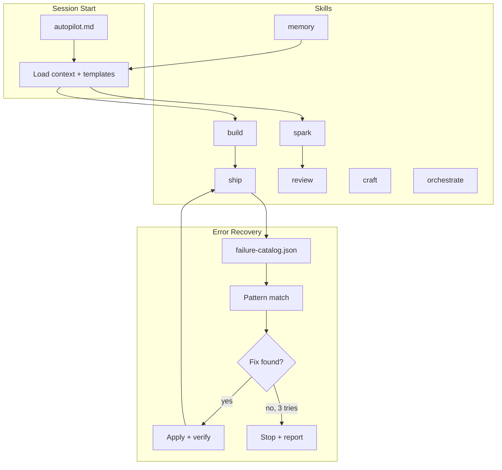

# solo-cto-agent

[](https://www.npmjs.com/package/solo-cto-agent)
[](https://github.com/seunghunbae-3svs/solo-cto-agent/actions/workflows/package-validate.yml)
[](https://github.com/seunghunbae-3svs/solo-cto-agent/actions/workflows/test.yml)
[](https://github.com/seunghunbae-3svs/solo-cto-agent/actions/workflows/changelog.yml)
[](LICENSE)

> **Languages**: English (primary) · [한국어 요약](#한국어-요약-korean-summary) below.

I made this because I got tired of using AI coding tools that were good at writing code, but still left me doing all the messy CTO work around it.

The hard part was rarely "write the feature." It was everything around the feature:

* catching missing env vars before a deploy breaks
* not re-explaining the same stack every new session
* stopping error loops before they waste half an hour
* getting honest pushback on ideas instead of empty encouragement
* cleaning up UI that looks obviously AI-generated

This repo is my attempt to package those habits into a small set of reusable skills. It is not magic. It is not a replacement for judgment. It is just a better operating system for the kind of AI agent I wanted to work with.

## What this is

`solo-cto-agent` is an opinionated skill pack for solo founders, indie hackers, and small teams using AI coding agents in their build workflow.

Primary workflow: **Claude Cowork + OpenAI Codex**. This is the only combination that gets the full feature surface (dual review, cross-check, routing, UI/UX vision). Other AI editors (Cursor, Windsurf, Copilot) are supported as a legacy compatibility layer via the included rule files — see [Appendix: Legacy multi-editor support](#appendix-legacy-multi-editor-support) at the bottom of this README. The rest of this document assumes Cowork + Codex.

The point is simple:

* less repetitive setup work
* less context loss between sessions
* less AI slop in code and design
* more useful criticism before you commit to bad ideas
* more initiative from the agent on low-risk work

## What changes in practice

This is the difference I wanted in day-to-day use:

| Without this | With this |
| -------------------------------------------- | -------------------------------------------------------------- |
| Same build error over and over | Circuit breaker stops the loop and summarizes the likely cause |
| "Please add this manually to your dashboard" | Agent checks setup earlier and asks once when needed |
| New session, same explanation again | Important decisions get reused |
| Rounded-blue-gradient AI UI | Design checks push for more intentional output |
| "Looks good to me" feedback | Review forces actual criticism |
| Agent asks permission for every tiny step | Low-risk work gets done without constant back-and-forth |

## Who this is for

This repo is probably useful if you:

* build mostly alone or with a very small team
* already use Claude Cowork (optionally with Codex) as your primary AI coding workflow
* want the agent to take more initiative
* care about startup execution, not just code completion
* are okay with opinionated defaults

It is probably not a good fit if you:

* work in a tightly locked-down enterprise environment
* do not want agents touching files or setup
* want every action manually approved
* prefer a neutral framework-agnostic starter pack with very conservative defaults

---

## 한국어 요약 (Korean summary)

> 영어가 기본 문서이고, 아래는 핵심만 요약한 한국어 버전입니다. 전체 명세는 위 영어 본문을 우선 참고하세요.

### 이게 뭐야

`solo-cto-agent` 는 **Claude Cowork + OpenAI Codex** 조합을 기본으로 하는, 솔로 파운더 · 인디해커 · 소규모 팀을 위한 AI 코딩 에이전트용 skill pack 입니다. "코드를 대신 쓰는 도구" 가 아니라 "그 코드를 둘러싼 CTO 수준의 잡무를 대신 돌려주는 loop" 가 목적입니다.

- 같은 빌드 에러를 무한 반복하지 않도록 **circuit breaker** 로 루프를 끊고 요약합니다.
- 세션마다 스택을 다시 설명할 필요가 없도록 **중요한 결정사항을 재사용** 합니다.
- 리뷰가 "좋아 보여요" 로 끝나지 않도록 **자기 교차 리뷰 (self cross-review) + dual-review (Cowork+Codex)** 를 강제합니다.
- AI 티 나는 디자인을 잡기 위한 **UI/UX 감시 skill** 을 포함합니다.
- 리스크 낮은 작업은 매번 허락을 받지 않고 agent 가 먼저 처리합니다.

### 누구에게 맞나

- 거의 혼자 빌드하거나 2-3명 팀인 경우.
- Claude Cowork (선택적으로 Codex) 가 이미 주 워크플로우인 경우.
- 엔터프라이즈 수준의 강한 승인 체계가 필요한 팀에는 맞지 않습니다.
- Cursor / Windsurf / Copilot 은 **legacy compatibility** 로만 지원합니다. 본 문서 최하단 Appendix 참고.

### 빠른 시작

```bash
# 한 번만: 글로벌 프리셋 설치
npx solo-cto-agent init --wizard

# 매 리뷰 (staged 변경 기준)
npx solo-cto-agent review

# Codex 키가 있을 때 — 서로 다른 모델 패밀리의 교차 검증
npx solo-cto-agent dual-review
```

자세한 설치/운영 가이드: [`docs/cowork-main-install.md`](docs/cowork-main-install.md) — 한국어 본문.

### Tier 축 (기능 범위)

| Tier | 범위 | 필요한 키 |
|---|---|---|
| **Maker** | review · knowledge · session | `ANTHROPIC_API_KEY` |
| **Builder** (default) | Maker + build · ship · apply-fixes · watch · notify | 위 + (선택) `OPENAI_API_KEY` |
| **CTO** | Builder + orchestrate · routing-engine · dual-review | 위 둘 다 + 권장: CI |

Tier 상세 정의: [`docs/tier-matrix.md`](docs/tier-matrix.md) (한글 본문).

### 외부 루프 정책 (Self-loop 경고)

리뷰를 **자기 혼자 쓴 diff 를 자기 한 명이 본다** 면 blind spot 이 반복됩니다. 본 패키지는 세 가지 외부 신호 (T1 peer model · T2 external knowledge · T3 ground truth) 를 감지해 부족하면 경고합니다. 전체 정책: [`docs/external-loop-policy.md`](docs/external-loop-policy.md).

### 핵심 문서 바로가기

- 설치/운영 (한글 본문): [`docs/cowork-main-install.md`](docs/cowork-main-install.md)
- Tier 정의 (한글 본문): [`docs/tier-matrix.md`](docs/tier-matrix.md)
- Tier 사용 예 (한글 본문): [`docs/tier-examples.md`](docs/tier-examples.md)
- CTO 운영 정책 (한글 본문): [`docs/cto-policy.md`](docs/cto-policy.md)
- 외부 루프 정책 (영한 병기): [`docs/external-loop-policy.md`](docs/external-loop-policy.md)
- 피드백 가이드 (영한 병기): [`docs/feedback-guide.md`](docs/feedback-guide.md)
- Skill slimming 패턴 (영한 병기): [`docs/skill-slimming.md`](docs/skill-slimming.md)

---

## What's inside

```text
solo-cto-agent/
├── autopilot.md
├── skills/
│   ├── build/
│   │   └── SKILL.md
│   ├── ship/
│   │   └── SKILL.md
│   ├── craft/
│   │   └── SKILL.md
│   ├── spark/
│   │   └── SKILL.md
│   ├── review/
│   │   └── SKILL.md
│   └── memory/
│       └── SKILL.md
└── templates/
    ├── project.md
    └── context.md
```

## Three Axes — Tier × Agent × Mode

`solo-cto-agent` 의 설정은 **서로 독립적인 세 축**의 조합이다. 하나만 고르는 게 아니라 셋을 각각 선택한다.

| 축 | 의미 | 값 |
|---|---|---|
| **Tier** (기능 레벨) | 어떤 스킬/기능 범위를 쓸 것인가 | `Maker` / `Builder` / `CTO` |
| **Agent** (에이전트 구성) | 누가 작업/리뷰하는가 | `Cowork` (Claude 단독) / `Cowork + Codex` (Dual) |
| **Mode** (자동화 모드) | 언제 어디서 자동으로 돌릴 것인가 | `Semi-auto` = cowork-main / `Full-auto` = codex-main |

판정 기준, 출력 포맷, 코드 리뷰 체크리스트, Circuit Breaker 정책은 **세 축 전체에서 공통이다.**
차이는 축마다 하나씩 — 어떤 기능까지 쓰냐 (Tier), 누가 리뷰하냐 (Agent), 어디서 자동화되냐 (Mode).

> 자세한 정의: `docs/tier-matrix.md` · `docs/tier-examples.md` · `docs/cto-policy.md` · `docs/cowork-main-install.md`

### Mode 축 — Semi-auto vs Full-auto

| | **Semi-auto** = `cowork-main` | **Full-auto** = `codex-main` |
|---|---|---|
| **포지션** | Claude Cowork desktop + cloud amplifiers | 풀 자동 CI/CD 파이프라인 |
| **실행 위치** | Claude Cowork / 로컬 CLI | GitHub Actions |
| **트리거** | 에이전트 판단, 사용자 호출, scheduled tasks | webhook, repository_dispatch |
| **클라우드 활용** | API 다건 (Claude, OpenAI, GitHub, Vercel, Supabase, Figma, Drive, Slack…) | GitHub Actions 내부 완결 |
| **에러 패턴** | `sync --apply` 로 수동 머지 (라이브 MCP 크로스체크) | CI 실패에서 자동 수집 |
| **Agent scores** | 필요할 때 sync | PR 이벤트마다 자동 업데이트 |
| **기본 권장 Tier** | Maker / Builder | Builder / CTO |
| **가장 적합** | 솔로 파운더, 크리에이터, 멀티 프로젝트 운영자 | CI/CD 인프라 있는 팀 |

**세 축 공통 (agent spec parity):**

| 항목 | 모든 조합에서 동일 |
|---|---|
| 에이전트 정체성 | CTO 급 co-founder. 어시스턴트 아님. |
| 판정 분류 | `APPROVE` / `REQUEST_CHANGES` / `COMMENT` (한글: 승인/수정요청/보류) |
| 심각도 | `BLOCKER` ⛔ / `SUGGESTION` ⚠️ / `NIT` 💡 |
| 팩트 태깅 | `[확정]` / `[추정]` / `[미검증]` |
| 임베드 컨텍스트 | Ship-Zero Protocol + Project Dev Guide + 코딩 규칙 |
| 리뷰 체크리스트 | 10항목 (import, Prisma, NextAuth, Supabase, TS, 에러, 보안, 배포, Next 버전, Tailwind 버전) |
| Circuit Breaker | 3회 재시도, rate-limit 30s/60s/90s 백오프 |
| 출력 포맷 | `[VERDICT]` / `[ISSUES]` / `[SUMMARY]` / `[NEXT ACTION]` |

> 표준 명세: `skills/_shared/agent-spec.md`
> 임베드 컨텍스트: `skills/_shared/skill-context.md`

```bash
npx solo-cto-agent init --wizard
# Prompts: Choose mode → [1] codex-main  [2] cowork-main
```

### Semi-auto mode (`cowork-main`) — Desktop-Native AI CTO

Semi-auto mode runs **inside Claude Cowork** as a self-contained AI CTO. Cowork agent 루프 자체가 자동화 엔진이고, MCP 커넥터·web search·scheduled tasks 같은 cloud amplifier 를 엮어 품질을 완성한다. CI, webhook 필요 없음.

Agent 축은 Mode 와 독립이다 — Semi-auto 안에서도 Cowork 단독 / Cowork+Codex 둘 다 가능 (키 유무로 자동 감지).

> **Full guide:** [`docs/cowork-main-install.md`](docs/cowork-main-install.md) — 3축 설명, install, daily workflow, cloud amplifiers, 개인화, env vars, troubleshooting.

**Default posture:** remote side-effects OFF. In-session agent automation ON. Every remote operation (`sync --apply`, PR push) is opt-in.

| Command | Behavior |
|---|---|
| `solo-cto-agent review` | Local Claude review of `git diff` (staged / branch / file). No GitHub required. Supports `--json` / `--markdown` / `--solo` / `--dry-run`. |
| `solo-cto-agent dual-review` | Claude + OpenAI cross-review locally. Auto-enabled when both keys present. |
| `solo-cto-agent uiux-review code\|vision\|cross-verify\|baseline\|tokens` | UI/UX review — diff code audit, vision 6-axis scoring (layout / typography / spacing / color / a11y / polish), code ↔ vision cross-verify, screenshot baseline diff, design-token extraction. |
| `solo-cto-agent apply-fixes --review <file.json>` | Parse `[FIX]` blocks from review JSON, validate with `git apply --check`, apply with `--apply` (clean-tree required). `--only BLOCKER,SUGGESTION`, `--max-fixes 5` circuit-breaker. |
| `solo-cto-agent feedback accept\|reject --location <path>` | Record accept/reject verdicts into personalization — down/up-weights future reviews (80/20 anti-bias rotation). `feedback show` displays accumulated patterns. |
| `solo-cto-agent watch [--auto] [--force]` | File watcher with tier gate. Only CTO tier + cowork+codex gets `--auto` by default (maker/builder manual-only, CTO+cowork-only needs `--force`). Emits scheduled-tasks manifest for Cowork MCP pickup. |
| `solo-cto-agent notify --title <t> [--channels slack,telegram]` | Outbound notification to Slack / Telegram / Discord / file / console. Auto-detects channels from env vars. |
| `solo-cto-agent knowledge` | Extract decisions / error patterns from recent commits into local knowledge articles. |
| `solo-cto-agent sync --org <org>` | **Dry-run by default.** Fetch agent-scores / error-patterns from orchestrator repo and display. |
| `solo-cto-agent sync --org <org> --apply` | Merge remote data into local cache. |
| `solo-cto-agent session save/restore/list` | Local session context — survives across Claude Code / Cowork sessions. |
| `solo-cto-agent doctor` | One-pass health check: skills, engine, API keys, lint, sync, catalog. |
| `solo-cto-agent status` | Local cache only — no network calls. |

#### Phase roadmap

| Phase | Scope | Status |
|---|---|---|
| **Phase 1** | Manual pull (`sync` dry-run default), local-cache `status`, `doctor`, session context | ✅ current |
| **Phase 2** | CI/CD post-run auto-commits `agent-scores.json` + error patterns to orchestrator repo → manual `sync` always gets fresh data | planned |
| **Phase 3** | Opt-in auto-sync at session start (`auto_sync: true` in SKILL.md) for power users | planned |

## Tier 축 — Maker / Builder / CTO

Tier 는 **어떤 기능/스킬 범위를 쓸 것인가** 를 결정하는 축이다. Agent 구성 · Mode 와는 독립적으로 선택한다.
상세 정의는 `docs/tier-matrix.md` 참조.

| Tier | 포함 스킬 | 기본 Agent 권장 | Mode 권장 |
|---|---|---|---|
| **Maker** | spark / review / memory / craft | Cowork 단독 | Semi-auto |
| **Builder** (default) | Maker + build + ship | Cowork 단독 또는 Cowork+Codex | Semi-auto 또는 Full-auto |
| **CTO** | Builder + orchestrate | Cowork+Codex (정책) | Full-auto (정책, `docs/cto-policy.md`) |

아래는 Builder / CTO Tier 의 풀 스펙 — Maker 는 가이드 워크플로우 중심이라 별도 인프라 요구 없음.

### Builder (Lv4) — Single-Agent, Default

For solo devs who want Claude reviewing every PR automatically. One agent, no extra infrastructure.

| What you get | Details |
|---|---|
| Agent | Claude (single) |
| Product repo workflows | 3 core + 1 optional (telegram) |
| Orchestrator workflows | 8 (single-agent only) |
| Skills | spark, review, memory, craft, build, ship |
| Required secrets | `ORCHESTRATOR_PAT`, `ANTHROPIC_API_KEY` |
| Optional secrets | `TELEGRAM_BOT_TOKEN`, `TELEGRAM_CHAT_ID` |

Product repo automation: PR opened → Claude auto-review → preview summary → rework cycle on review feedback.

### CTO (Lv5+6) — Multi-Agent

For teams or power users who want agents competing and cross-checking each other. Claude + Codex by default, with a routing-engine designed to accept custom agents if you want to extend it.

| What you get | Details |
|---|---|
| Agents | Claude + Codex (extensible via `agent-scores.json`) |
| Product repo workflows | 7 core + 1 optional (telegram) |
| Orchestrator workflows | 24 (8 base + 16 multi-agent & pro) |
| Skills | all Builder skills + orchestrate |
| Required secrets | `ORCHESTRATOR_PAT`, `ANTHROPIC_API_KEY`, `OPENAI_API_KEY` |
| Optional secrets | `TELEGRAM_BOT_TOKEN`, `TELEGRAM_CHAT_ID` |
| Extra features | UI/UX 4-stage quality gate, daily briefings, decision tracking, agent scoring, comparison reports |

Product repo automation: PR opened → Claude + Codex both review → cross-review each other → comparison report → rework dispatch on issues → optional Telegram notifications.

### What CTO adds over Builder

| Capability | Builder (Lv4) | CTO (Lv5+6) |
|---|---|---|
| Claude auto-review | Yes | Yes |
| Codex auto-review | — | Yes |
| Cross-review (agents review each other) | — | Yes |
| Comparison reports | — | Yes |
| Agent score tracking | — | Yes |
| UI/UX quality gate (4-stage) | — | Yes |
| Visual regression (Playwright + Vision) | Scheduled | Scheduled + PR-triggered |
| Daily briefings | — | Yes |
| Decision queue + insights | — | Yes |
| Telegram notifications | Optional | Optional |
| Rework dispatch | Yes | Yes |
| Preview summary | Yes | Yes |
| Circuit breaker (3-fail stop) | Yes | Yes |

### Visual Verification (Both tiers)

Visual checks use Playwright for real browser screenshots (desktop 1280px + mobile 375px). Scheduled mode runs every 6 hours comparing against baselines and opens issues on visual regression. PR mode triggers on preview deployment, screenshots the preview URL, and posts results as a PR comment. Falls back to thum.io if Playwright is unavailable.

### Auto Service Detection (Both tiers)

When you run `setup-pipeline` or `setup-repo`, the CLI scans your project's `package.json` and file structure to detect required services (NextAuth, Supabase, Stripe, Prisma, Firebase, AWS, etc.). It then prints every secret needed and generates copy-paste `gh secret set` commands for one-shot setup. No more discovering missing secrets mid-deployment.

### Local Code Review (No CI/CD Required)

Run a Claude-powered code review directly from your terminal, no GitHub Actions needed:

```bash
# Review last commit
ANTHROPIC_API_KEY=sk-xxx solo-cto-agent review

# Review a branch diff (dry-run: see the prompt without calling API)
solo-cto-agent review --diff main..feature --dry-run

# Review specific directory
solo-cto-agent review --path ./src --diff HEAD~3
```

The review checks your diff against the local failure catalog (known error patterns), then sends it to Claude for security, performance, correctness, and style analysis. Results are saved as markdown reports in `~/.claude/skills/solo-cto-agent/reviews/`. This is the same review quality as the CI/CD pipeline, but runs entirely locally — useful for private repos, offline work, or pre-push checks.

### Local Code Review (Both tiers)

Run multi-agent code review locally without GitHub Actions:

```bash
# Claude review of staged changes
ANTHROPIC_API_KEY=sk-xxx solo-cto-agent review --diff staged

# Dual-agent review (Claude + GPT) of branch diff
ANTHROPIC_API_KEY=sk-xxx OPENAI_API_KEY=sk-xxx solo-cto-agent review --diff branch

# Output as markdown file
solo-cto-agent review --diff staged --output markdown --file review.md
```

Works completely offline from CI/CD. Claude reviews the diff first. If an OpenAI key is also set, GPT provides a second opinion and the tool cross-compares both reviews — highlighting agreed issues (high confidence) vs. divergent findings. New error patterns found during review are automatically added to the local failure catalog.

**Ground-truth grounding (T3 — PR-E1).** If `VERCEL_TOKEN` is set and the repo has a `.vercel/project.json` (from `vercel link`) or `VERCEL_PROJECT_ID` is exported, every `review` and `dual-review` automatically fetches the last 10 deployments and injects a `## 최근 프로덕션 신호 (T3 Ground Truth)` block into the system prompt. The review model uses this as [확정] evidence — for example, if there's a recent `ERROR` deployment, the review explicitly cross-checks whether the current diff might be related. This is the cheapest way to escape the pure self-loop described in [`docs/external-loop-policy.md`](docs/external-loop-policy.md) — runtime behavior beats model opinion. Failures (missing token, unreachable API, timeout) never block the review; the section is simply omitted or marked `[미검증]`.

### Knowledge Article Generation (Both tiers)

Auto-generates durable knowledge articles from accumulated session memory:

```bash
# Dry-run: show which articles would be generated
solo-cto-agent knowledge

# Generate articles
solo-cto-agent knowledge --apply
```

Scans `memory/episodes/`, `CONTEXT_LOG.md`, and `error-patterns.md` for topics that appear 3+ times. When a recurring pattern is detected, it generates a structured knowledge article at `memory/knowledge/{topic}.md` and updates the index. This is the Layer 2 → Layer 3 compression that the memory skill describes but previously required manual effort.

### Local ↔ Remote Sync

The `sync` command bridges the gap between your local skill files and remote CI/CD results. It runs in dry-run mode by default — fetches and displays data without modifying local files. Add `--apply` to merge remote data into local:

```bash
# Dry-run: fetch + display only (safe, no local changes)
GITHUB_TOKEN=ghp_xxx solo-cto-agent sync --org myorg --repos app1,app2

# Apply: merge remote error patterns + update local agent scores
GITHUB_TOKEN=ghp_xxx solo-cto-agent sync --org myorg --repos app1,app2 --apply
```

What it fetches and updates (with `--apply`):

| Data | Source | Local file |
|---|---|---|
| Agent scores | `ops/orchestrator/agent-scores.json` | `~/.claude/skills/solo-cto-agent/agent-scores-local.json` |
| Workflow runs | GitHub Actions API | displayed in sync output |
| PR reviews | Pull request review API | displayed in sync output |
| Visual baselines | `ops/orchestrator/visual-baselines.json` | displayed in sync output |
| Error patterns | Remote failure-catalog | merged into local `failure-catalog.json` |

After syncing, `solo-cto-agent status` shows when data was last synced and how many agents are tracked locally.

### Agent Score Personalization (CTO tier)

`agent-scores.json` auto-updates on every PR event, review, and CI run. Scores are tracked globally and per-repo (`by_repo`), so the routing engine learns which agent performs better on which project. History is kept for trend analysis, and feedback patterns from `repository_dispatch` events feed into personalization. Over time the system routes work to the best-performing agent for each repo.

### Multi-Agent Extensibility (CTO tier)

The routing engine (`ops/orchestrator/routing-engine.js`) dynamically adapts to the number of registered agents. Builder tier ships with Claude-only `agent-scores.json` and `routing-policy.json` (default: `single-agent` mode). CTO tier ships with Claude + Codex dual-agent config. To plug in a third agent, extend `agent-scores.json` with its metrics and add a corresponding workflow. The routing engine auto-detects registered agents and skips dual-agent logic when only one agent exists.

### Secrets Summary

| Secret | Builder | CTO | Where to get |
|---|---|---|---|
| `ORCHESTRATOR_PAT` | Required | Required | github.com/settings/tokens (scope: repo + workflow) |
| `ANTHROPIC_API_KEY` | Required | Required | console.anthropic.com |
| `OPENAI_API_KEY` | — | Required | platform.openai.com/api-keys |
| `TELEGRAM_BOT_TOKEN` | Optional | Optional | t.me/BotFather |
| `TELEGRAM_CHAT_ID` | Optional | Optional | Telegram API |
| `GITHUB_TOKEN` | Auto | Auto | Provided by GitHub Actions |

Not CI/CD secrets (app-level only, set in your hosting dashboard separately): `VERCEL_TOKEN`, `SUPABASE_*`, `gh` CLI auth.

---

## 5-Minute Quick Start

Three steps, under two minutes:

1) Install with interactive wizard (recommended)
```bash
npx solo-cto-agent init --wizard
```
The wizard asks about your stack (framework, deploy target, database, etc.) and generates a configured `SKILL.md` automatically. No manual placeholder editing needed.

Or install without wizard and edit manually:
```bash
npx solo-cto-agent init --preset builder
# Then open ~/.claude/skills/solo-cto-agent/SKILL.md and replace {{YOUR_*}} placeholders
```

2) Verify
```bash
solo-cto-agent status
```

3) (Optional) Sync CI/CD data
```bash
GITHUB_TOKEN=ghp_xxx solo-cto-agent sync --org myorg           # preview (dry-run)
GITHUB_TOKEN=ghp_xxx solo-cto-agent sync --org myorg --apply   # merge remote → local
```

Presets:
- `maker` = spark + review + memory + craft
- `builder` (default) = maker + build + ship
- `cto` = builder + orchestrate

### Pipeline Setup (CI/CD Automation)

After installing skills, deploy the full CI/CD pipeline:

```bash
# Builder tier (single-agent: Claude)
npx solo-cto-agent setup-pipeline --org myorg --repos myapp1,myapp2

# CTO tier (multi-agent: Claude + Codex + cross-review)
npx solo-cto-agent setup-pipeline --org myorg --tier cto --repos myapp1,myapp2,myapp3
```

Or use the bash script:
```bash
bash setup.sh --org myorg --tier cto --repos myapp1,myapp2
```

## Demo


## Cowork Working Model

The system supports two working models depending on your API keys and workflow preference.

### Mode A: Cowork Solo (Claude only)

Everything runs locally via the Anthropic API. No GitHub Actions required.

```text
You write code
  → solo-cto-agent review          # Claude reviews your staged changes
  → solo-cto-agent knowledge       # extracts decisions into knowledge articles
  → solo-cto-agent sync --org X    # fetches remote CI data (dry-run by default)
  → git push                       # GitHub Actions (if set up) handles the rest
```

Requirements: `ANTHROPIC_API_KEY` only. This mode is ideal for Cowork Desktop users who want local review + memory without CI/CD infrastructure.

What you get locally without CI/CD: code review, error pattern matching against failure catalog, session decision capture, knowledge article generation. What requires CI/CD: cross-repo dispatch, automated rework cycles, visual regression, agent score tracking.

### Mode B: Cowork + Codex Dual

Both Claude and OpenAI review your code independently, then the system cross-compares.

```text
You write code
  → solo-cto-agent review          # auto-detects both keys, runs dual review
  → Claude reviews                 # via Anthropic API
  → OpenAI reviews                 # via OpenAI API
  → Cross-comparison report        # agreements, disagreements, final verdict
```

Requirements: `ANTHROPIC_API_KEY` + `OPENAI_API_KEY`. Use `--solo` flag to force Claude-only mode even when both keys are set.

The dual mode surfaces issues that one agent misses — Claude tends to catch architectural concerns while OpenAI tends to catch implementation bugs. Disagreements between agents are the most valuable signal.

### Semi-Automatic Sync

The `sync` command solves the local↔remote gap without requiring webhooks:

```text
Local (Cowork)                         Remote (GitHub Actions)
─────────────────                      ──────────────────────
failure-catalog.json  ← sync --apply → failure-catalog.json
agent-scores-local.json  ← sync ────→ agent-scores.json
reviews/ (local)         ← sync ────→ workflow runs, PR reviews
knowledge/               (local only)  (no remote equivalent)
```

Sync is read-only by default (`dry-run`). Add `--apply` to merge remote error patterns into local. This is intentional — automatic merging without review is risky.

## Architecture



## Install

### npm (recommended)

```bash
npm install -g solo-cto-agent
solo-cto-agent init
```

### Maintainer note (publish)

Publishing requires either:
- an Automation token with Bypass 2FA enabled, or
- a 6-digit OTP from an Authenticator app

### Quick install (Claude Code)

```bash
curl -sSL https://raw.githubusercontent.com/seunghunbae-3svs/solo-cto-agent/main/setup.sh | bash
```

### Manual install

```bash
git clone https://github.com/seunghunbae-3svs/solo-cto-agent.git
cp -r solo-cto-agent/skills/* ~/.claude/skills/
cat solo-cto-agent/autopilot.md >> ~/.claude/CLAUDE.md
```

### Only want one skill?

```bash
cp -r solo-cto-agent/skills/build ~/.claude/skills/
```

Then open the skill file and replace the placeholders with your actual stack. Example:

```text
{{YOUR_OS}}        -> macOS / Windows / Linux
{{YOUR_EDITOR}}    -> Cowork / VSCode / etc.
{{YOUR_DEPLOY}}    -> Vercel / Railway / Netlify / etc.
{{YOUR_FRAMEWORK}} -> Next.js / Remix / SvelteKit / etc.
```

### Using with Cowork + Codex

Codex is a first-class target. Use the SKILL.md files directly as your instruction source. No extra Codex-specific files are required — Cowork reads SKILL.md natively, and Codex (via OpenAI API) is invoked through the CLI when both keys are set.

> Support for other AI editors (Cursor, Windsurf, GitHub Copilot) via their native rule files is kept as a legacy compatibility layer — see [Appendix: Legacy multi-editor support](#appendix-legacy-multi-editor-support).

## How I use autonomy

Most agent workflows feel too timid in the wrong places and too reckless in the dangerous ones. So I split behavior into 3 levels.

### L1 - just do it

Small, low-risk work should not need approval. Examples:

* fixing typos
* creating obvious files
* loading context
* choosing an output format
* doing routine search or setup checks

### L2 - do it, then explain

If something is a bit ambiguous but still low-risk, the agent makes the best assumption, does the work, and tells me what it assumed. That is usually better than spending 10 messages clarifying something that could have been resolved in one pass.

### L3 - ask first

Some things still need explicit approval:

* production deploys
* schema changes
* cost-increasing decisions
* anything sent under my name
* actions that could cause irreversible damage

That split has worked much better for me than asking permission every 30 seconds.

## Skills

### build

This is the one I use most. Its job is to reduce the annoying parts of implementation work:

* check prerequisites before coding
* catch missing env vars, packages, migrations, or config earlier
* keep scope from drifting
* stop repeated error loops
* keep build and deploy problems from bouncing back to the user too quickly

The core idea is simple:

> do more of the setup thinking before writing code, not after something fails.

### ship

The job is not done when the code is written. It is done when the deploy works.

This skill treats deploy failures as part of the work:

* monitor the build
* read the logs
* try reasonable fixes
* stop when a circuit breaker is hit
* escalate clearly instead of spiraling

### craft

This exists because AI-generated UI often has a very obvious look. Too many gradients. Too much rounded everything. Too many generic SaaS defaults that look "fine" but still feel cheap.

This skill is an opinionated design filter:

* typography rules
* color discipline
* spacing consistency
* motion sanity
* anti-slop checks

It does not guarantee great design, but it helps avoid lazy AI design.

### spark

For idea work, I wanted something better than "this market is huge."

This skill takes an early idea and forces it through structure:

* market scan
* competitors
* unit economics
* scenarios
* risk framing
* PRD direction

Useful when an idea is still vague but you need something more testable.

### review

This skill is intentionally not friendly. It looks at a plan from three perspectives:

* investor
* target user
* smart competitor

The point is to expose weak points early, not to make the founder feel good.

### memory

This is for reducing repeat explanation and preserving useful context.

Not everything needs to be remembered forever. But decisions, repeated failure patterns, and project context should not disappear every session.

## Skill slimming

When skills grow past 150 lines, most of that weight is reference data the agent doesn't need on every activation. The `references/` pattern splits hot-path logic from cold-path data, cutting token costs by 58-79% per skill without losing functionality.

See [docs/skill-slimming.md](docs/skill-slimming.md) for the pattern, measured results, and how to apply it.

## Feedback and personalization

The system learns from CI/CD events automatically, but you can accelerate it with explicit feedback. See [docs/feedback-guide.md](docs/feedback-guide.md) for how to send feedback, what categories exist, and how the routing engine uses it.

## Design principles

### Agent does the work, user makes decisions

If the agent can reasonably figure something out, it should do that. The user should spend time on judgment calls, not repetitive setup.

### Risks before strengths

Good review starts with what is broken, vague, or contradictory. Praise comes after that.

### Facts over vibes

If a number appears, it should have a source, a formula, or a clear label like:

* `[confirmed]`
* `[estimated]`
* `[unverified]`

### Pre-scan, don't surprise

A lot of agent frustration comes from late discovery: missing env vars, missing package installs, missing DB changes, missing credentials. This pack tries to catch those earlier.

### Keep the loop bounded

If the same problem keeps happening, stop and report clearly. An agent that loops forever is worse than one that asks for help.

## What this is not

This is not:

* a hosted product
* a full framework
* a universal standard for agent behavior
* a replacement for technical judgment

It is just a set of operating rules that worked well enough for me to package and share.

## Recommended first use

If you want to try this without changing your whole workflow:

1. install only `build` and `review`
2. replace the stack placeholders
3. use them on one real feature or bug
4. see whether the agent becomes more useful or just more opinionated

That is the easiest way to tell whether this fits how you work.

## License

MIT - fork it, modify it, ship it.


---

## Post-install verification

After installation, verify the pack works:

1. Check skills exist in your agent directory (e.g. `~/.claude/skills`)
2. Confirm each skill has valid frontmatter (`---` block)
3. Run a simple prompt like "Use build to fix a TypeScript error"
4. Run `bash scripts/validate.sh` to check file integrity
5. Confirm no auto-merge or deploy happens without approval

If something fails, re-run `setup.sh --update` and check again.


---

## Sample output

**Build (preflight + fix)**
```
[build] pre-scan: missing env vars: STRIPE_SECRET_KEY, STRIPE_WEBHOOK_SECRET
[build] request: please provide the 2 keys above before proceeding
[build] applied: fixed prisma client mismatch
[build] build: npm run build -> OK
[build] report: 3 files changed, 1 risk flagged, rollback path noted
```

**Review + rework**
```
[review] Codex: REQUEST_CHANGES (blocker: missing RLS policy)
[review] Claude: APPROVE (nits: copy, spacing)
[rework] round 1/2 -> fixed RLS policy + added tests
[decision] recommendation: HOLD until preview verified
```


---

## FAQ

**Q: Do I need all six skills?**
A: No. Start with `build` and `review`. Add the others if you find yourself wanting them. Each skill is independent.

**Q: Why does the agent stop retrying after 3 attempts?**
A: Infinite loops waste more time than they save. If something fails 3 times, the agent summarizes what it knows and hands control back to you.

**Q: Why is the design skill so opinionated?**
A: Because default AI output tends toward the same rounded-gradient look. The rules push for more intentional choices. Override whatever doesn't fit your taste.

**Q: Does this work in Cursor/Windsurf/Copilot?**
A: The primary, fully-supported workflow is Claude Cowork + OpenAI Codex. The repo also ships `.cursorrules`, `.windsurfrules`, and `.github/copilot-instructions.md` as a legacy compatibility layer that carries the same philosophy — see [Appendix: Legacy multi-editor support](#appendix-legacy-multi-editor-support). Full features (dual review, UI/UX vision, routing-engine, watch-mode auto-trigger) only surface through the CLI, which calls Claude + OpenAI APIs directly.

**Q: Why a separate orchestrator repo?**
A: The orchestrator holds cross-repo logic (agent routing, score tracking, visual baselines, daily briefings) that doesn't belong in any single product repo. It dispatches workflows across your product repos and collects results centrally. If you only have one product repo, you can still use it — the separation keeps CI/CD config out of your application code.

**Q: How much do the API calls cost?**
A: Typical per-PR cost depends on your review depth. A Claude auto-review of a medium PR (under 500 lines changed) uses roughly 5K–15K input tokens and 1K–3K output tokens. At Anthropic's Sonnet pricing that is well under $0.10 per review. If you add Codex cross-review (CTO tier), add roughly $0.05–0.15 per review for the OpenAI side. A solo dev doing 2-3 PRs per day can stay comfortably under $5/month on Anthropic and $5/month on OpenAI. Visual checks (Playwright screenshots) use no API tokens — they run in GitHub Actions compute only.

**Q: Can I use this without GitHub Actions?**
A: The skills (init, build, review, craft, etc.) work independently of CI/CD. You can install them and use them in your editor without ever running setup-pipeline. The CI/CD automation is an optional layer on top.

**Q: How do I keep local skill data in sync with CI/CD results?**
A: Run `solo-cto-agent sync --org <your-org>`. This fetches agent scores, workflow results, PR reviews, and error patterns from your orchestrator repo via the GitHub API. By default it runs in dry-run mode (display only). Add `--apply` to merge remote data into local files. This way you always preview what will change before any local files are modified.

**Q: What does a real review look like?**
A: Here is a trimmed example from a production PR review:

```
[claude-review] PR #42 — Add group-buying countdown timer
  ⚠️ CHANGES_REQUESTED
  - Missing error boundary around countdown component
  - useEffect cleanup not handling unmount (memory leak risk)
  - Hardcoded timezone offset — use Intl.DateTimeFormat instead
  - Price calculation should use Decimal, not float
  ✅ Good: proper loading states, accessible aria-labels
```

The review targets real issues (memory leaks, timezone bugs, floating-point money) rather than style nits.

**Q: What happens on Day 1 with no data?**
A: Everything works — skills activate, build checks run, reviews trigger. The system starts empty and accumulates value over time. Agent scores begin tracking from the first PR. Error patterns grow as the failure catalog catches new issues. By session 10+ you will notice fewer repeated errors and more context-aware reviews.

**Q: Does this make network calls automatically?**
A: No. `status` reads only local files. `sync` is manual and opt-in — you run it explicitly when you want CI/CD data pulled from GitHub. Error pattern merging from `sync` is dry-run by default; use `sync --apply` to actually write changes. No background network activity, no telemetry.

---

## Appendix: Legacy multi-editor support

The primary, fully-supported workflow for `solo-cto-agent` is **Claude Cowork + OpenAI Codex**. That is the only combination that gets the full feature surface — dual review, cross-check, routing-engine, UI/UX 6-axis vision scoring, `apply-fixes` / `watch` / `notify` CLI wiring, and the `cto` tier pipeline.

For users on other AI editors, the repo ships three native rule files as a **legacy compatibility layer**. They carry the same CTO philosophy (autonomy levels, build discipline, review rules, Circuit Breaker policy) in each tool's native config format:

| Editor | File | How it's picked up |
|---|---|---|
| **Cursor** | `.cursorrules` | Cursor reads it from project root automatically |
| **Windsurf (Cascade)** | `.windsurfrules` | Windsurf reads it from project root automatically |
| **GitHub Copilot** | `.github/copilot-instructions.md` | Copilot reads it as workspace-level instructions |

Install in your project:

```bash
cp solo-cto-agent/.cursorrules ./
cp solo-cto-agent/.windsurfrules ./
cp -r solo-cto-agent/.github ./
```

### What works with the legacy layer

- Core philosophy (3-axis autonomy, BLOCKER/SUGGESTION/NIT severity, fact-tagging `[확정]/[추정]/[미검증]`)
- Review checklist (10 items — imports, Prisma, NextAuth, Supabase, TS, errors, security, deploy, Next version, Tailwind version)
- Verdict format (`[VERDICT]` / `[ISSUES]` / `[SUMMARY]` / `[NEXT ACTION]`)
- Circuit Breaker (3-retry + backoff)

### What does NOT work with the legacy layer

- `solo-cto-agent review` / `uiux-review` / `apply-fixes` / `feedback` / `watch` / `notify` — these CLI commands require Claude Cowork or the `solo-cto-agent` CLI running locally with API keys.
- Cross-review between agents — requires both `ANTHROPIC_API_KEY` and `OPENAI_API_KEY` and the `solo-cto-agent` CLI to orchestrate.
- `setup-pipeline` and the 8/24 workflow suite — requires GitHub Actions integration (the CLI generates these).

### Why it's kept "legacy"

Adding first-class support for every AI editor means maintaining 4+ parallel invocation paths for every feature. We chose instead to bet on one deep stack (Cowork + Codex) and leave the rule files as a fallback so existing Cursor/Windsurf/Copilot users are not locked out of the philosophy. If you are starting fresh, use Cowork + Codex — you get the full loop.
